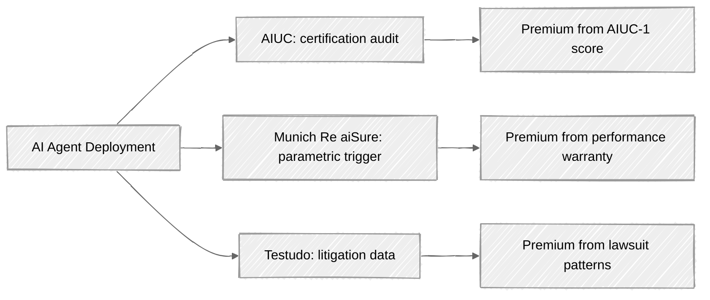
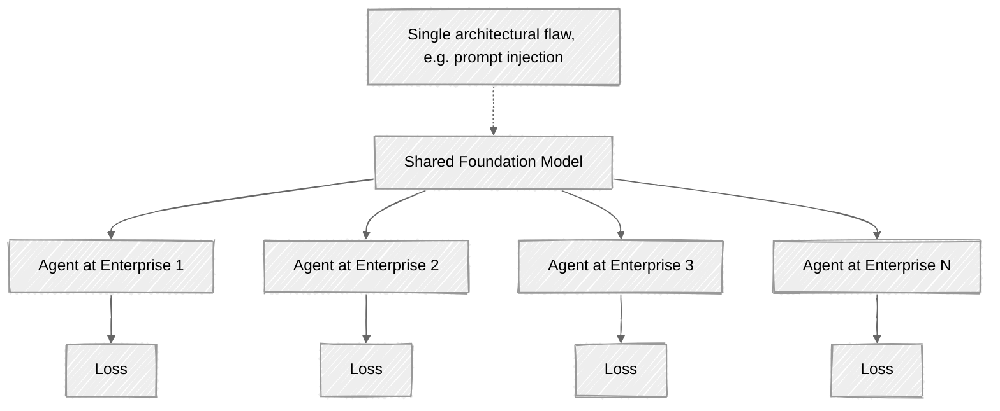
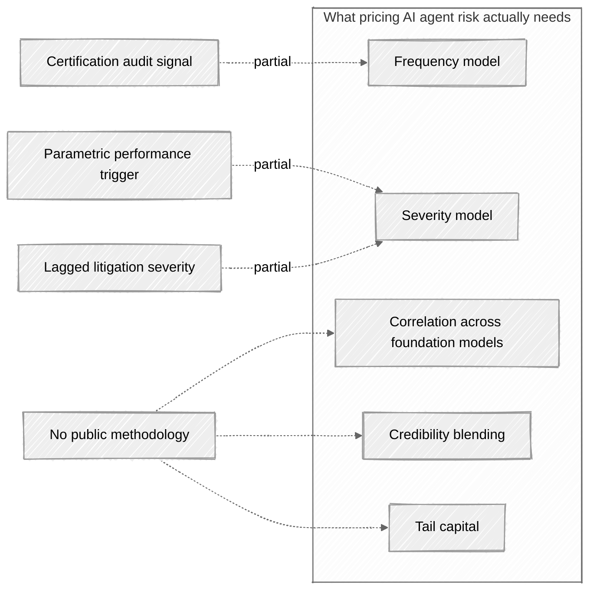

Sometime in late 2025, very quietly, the carriers writing the standard commercial general liability form decided they could no longer afford to keep writing generative AI. The new exclusions, effective the first of January 2026, don't read like a moral judgment so much as a tally. By the time they were drafted, the federal docket had absorbed something on the order of seven hundred AI-related lawsuits between 2020 and 2025, and filings were climbing a hundred and thirty-seven percent year over year by the end of 2024 ([Gallagher Re, *Smart Systems, Blind Spots*, March 2026](https://www.ajg.com/gallagherre/-/media/files/gallagher/gallagherre/news-and-insights/2026/march/rethinking-insurance-for-the-ai-era.pdf)). The peril, which had been a kind of ambient unease in underwriting committees for years, finally got a name and a carve-out. And in the small bureaucratic motion of that carve-out, a market opened up.

Into that gap walked three firms, each with a different theory of what had actually gone wrong. [AIUC](https://aiuc.com) certifies an AI agent against its AIUC-1 standard, runs thousands of adversarial scans, and prices the policy off the certification. [Munich Re's aiSure](https://www.munichre.com/en/solutions/for-industry-clients/insure-ai.html) writes a performance warranty, parametric in shape, settling fast on measurable performance failures rather than waiting for the litigation machinery to turn. [Testudo](https://www.testudo.co), a Lloyd's coverholder that emerged for exactly this 2026 exclusion, prices from a proprietary database of AI-related lawsuits and writes claims-made coverage with no technical audit at all. Three firms, three philosophies, three premiums for what is, underneath all of it, the same set of exposures.

The interesting question, when you sit with the three products side by side, is not really which one is right. It is whether any of them is pricing what an actuary would call a rate. A certification score, however granular, is not a rate. A parametric trigger on a performance metric, however cleanly it settles, is not a rate. A litigation-pattern benchmark, however diligently it is maintained, is not a rate. The market, taken together, has solved for something closer to "we have to write something." It has not yet solved for "we know what we're pricing."

This post is about the distance between those two conditions, and about who ought to be closing it.

## Thesis

Commercial AI agent insurance is already pricing risk that does not fit comfortably inside the classical insurability frame, often inconsistently from one underwriter to the next, and the actuarial methodology that would discipline those inconsistencies is only just beginning to show up in the academic literature. Most of what has shown up so far is being written by AI safety researchers reaching toward actuarial concepts, not by actuaries reaching toward AI. Both directions matter. The second one is still almost empty.

I am two years into actuarial training, which is to say I am not the person who will write the definitive paper on any of this. But from where I sit, the missing pieces are not hard to see, and they would not be hard for anyone else with the right training to see either. That visibility is itself worth noting: in this market right now, asking the right questions is rarer than answering them well, and the questions are mostly the kind only an actuary thinks to ask.

## Three underwriting models, one risk

If you read the marketing materials for the three live commercial models side by side, what you notice first is that they disagree about where the risk actually lives and how you ought to measure it. They are not, for the most part, specializing in different perils. They are pricing the same exposures, and pricing them in genuinely different ways.

**AIUC** is the certification-and-insurance model in something close to its purest form. The AIUC-1 standard, developed with Orrick and updated quarterly, covers fourteen categories of risk, including data and privacy, security, safety, reliability, accountability, and societal exposures. An AI vendor passes AIUC-1 by passing thousands of adversarial scans, technical control reviews, and policy audits, and the certification report that comes out the other end runs to something like a hundred pages. Once the agent is certified, AIUC writes insurance on top, backed by Lloyd's, with [limits up to $50 million](https://basilpuglisi.com/ai-risk-economy-insurance-governance/). The premium is shaped by audit results. The underlying theory is that the certificate carries information about future loss frequency, and that this information, by itself, is enough to price.

**Munich Re aiSure** has been writing AI-specific cover [since 2018](https://www.munichre.com/en/solutions/for-industry-clients/insure-ai/faq.html), longer than anyone else in the market. Its product is a performance warranty: if a defined performance metric fails, the policy pays. The structure is parametric-like, settling on measurable data rather than waiting for litigation outcomes. The 2026 [partnership with Mosaic](https://www.reinsurancene.ws/mosaic-and-munich-re-introduce-ai-specific-insurance-for-developers/) added up to $15 million in coverage capacity for AI developers and vendors against defined AI performance failures. aiSure is model-agnostic by design, treats AI as a peril that can be tested directly because there is not yet enough claims history to lean on, and shapes the premium through ongoing performance assessment rather than a one-time audit.

**Testudo**, the youngest of the three, [launched](https://www.testudo.co/insights/testudo-launches-new-insurance-coverage-for-liability-risks-created-by-generative-ai-systems) for exactly the 2026 CGL GenAI exclusion. It is a Lloyd's coverholder, A+ rated, with limits up to $9.25 million, and it writes claims-made third-party liability cover. Its underwriting machinery is a proprietary engine that ingests lawsuits, regulatory filings, and incidents in real time. Premium is shaped by litigation patterns rather than by technical posture. Testudo can quote without an invasive audit because, in their model, governance documentation is not the load-bearing variable. What is load-bearing is the lawsuit.

Three firms, then, working from three different theories of where the risk actually lives, and three premiums for what is, underneath all of it, the same set of exposures.

The actuarial question all three sidestep is whether their inputs actually predict losses in any disciplined sense. Does the AIUC-1 score correlate with reduced claims frequency? Does the aiSure performance trigger reflect the severity distribution of real failures? Does Testudo's litigation pattern capture pre-suit losses, or only the lagged tail arriving eighteen to twenty-four months later? Nobody has the data to answer these yet. The market is operating on prior beliefs about what predicts loss. Each prior is reasonable on its own terms. They cannot all be right at once.

## The four insurability conditions, applied

Classical insurability theory, when you strip it down to what it actually asks of a peril, wants four things before you write coverage on it: independent losses, a workable frequency-severity profile, a stable exposure base, and a peril you can define without it shifting under you as the policy year runs. AI agents do not get a clean pass on any of the four, and what is interesting is how each of the three commercial models fails a different one.

**Independence of losses.** This is where the three commercial models look weakest, and also where the academic literature has its sharpest recent contribution. A 2026 paper by Leung, Zhang, Ling, Toyoda, and Loh ([arXiv 2605.18784](https://arxiv.org/pdf/2605.18784)) names three boundary cases at the insurability frontier: architectural exploitability, the doctrinal exclusion of intentional acts, and systemic loss correlation across cedents driven by foundation-model concentration. The third is the one they call "genuinely novel," and the reason is structural. When ten thousand enterprises deploy agents built on the same foundation model, their losses are not independent in any sense an actuary would recognize. A single architectural flaw in that model is the AI version of a single hurricane track laid across Florida: one event, many correlated losses, and geographic diversification that does not help because the geography, in this case, is the model itself. None of AIUC, aiSure, or Testudo prices that correlation in any public way. None of them, as far as anyone outside the firms can tell, has the data to.

Last year I worked under Professor Ben Feng at Waterloo on a layered-risk model for national flood insurance, and when I read the foundation-model concentration problem now, the structural shape looks the same to me. Different peril, same shape on the coverage map.

**Frequency-severity profile.** This one fits, at least at one level of aggregation. At the per-deployment level, AI agent failures look like the kind of profile actuaries are comfortable with: high frequency, low-to-moderate severity, the sort of book you can model without reaching immediately for extreme value theory. At the systemic level, the profile changes shape entirely. Hendrycks's [*Introduction to AI Safety, Ethics, and Society*](research/ai-liability/Introduction%20to%20AI%20Safety%2C%20Ethics%2C%20and%20Society.pdf) (CRC Press, 2025) writes the classical risk equation directly in §4.1.2 as Risk(hazard) = P(hazard) × severity(hazard), and extends it in §4.1.5 to a four-factor decomposition with exposure and vulnerability folded in. He gets to the actuarial structure and, in a sense, stops there. In §8.5.2 he flags the limit explicitly: "there are amounts of compensation that even insurers could not afford. Moreover, sufficiently severe AI catastrophes may disrupt the legal system itself." That is the head and the tail of the profile in a single paragraph. The commercial market, as it exists today, is pricing the head. The tail is uninsurable in the strict sense, and probably belongs in a backstop discussion rather than in a pricing one.

**Stable exposure base.** This one is broken too, and broken in a way that is easy to miss until you try to compare quotes across the three firms. AIUC measures something close to per-agent. Munich Re aiSure measures performance failures, which are not, strictly speaking, exposure units at all but events. Testudo measures policy years against a lawsuit-pattern benchmark of its own construction. None of these are the same exposure base, and the market has not converged on whether the right unit is per agent, per agent-hour, per authorized action, or per dollar of automated transaction value. Without a shared exposure base, two underwriters writing what they call "the same risk" are not, in any actuarial sense, writing the same risk. ISO/IEC 42001 is the closest thing to a multi-stakeholder reference point, and it is a [voluntary management systems standard](https://basilpuglisi.com/ai-risk-economy-insurance-governance/), not a pricing convention.

**Definable and stable peril.** Capability drift breaks this one in a way that is particular to software. The agent you priced in March is a different agent in May: the foundation model updates, the tools change, the permissions expand. AIUC's quarterly update cycle is partly a response to this instability, but the policy term is annual, and the peril does not hold still for a year. The classical assumption that the thing you priced today is the thing being insured tomorrow is, for AI agent insurance, the assumption the product can least afford to make.

## Worked example: prompt injection as a correlated peril

If you want the actuarial structure of AI agent insurance to come into focus, the failure mode to pick is the one the market has the most public data on, which at the moment is prompt injection.

Prompt injection sits at the top of the [OWASP LLM Top 10 for 2026](https://elevateconsult.com/insights/owasp-llm-top-10-security-vulnerabilities-every-ai-developer-must-know-in-2026/), present, by their count, in seventy-three percent of audited production deployments. The attack-success rate in agentic systems, according to [Vectra's most recent industry data](https://www.vectra.ai/topics/prompt-injection), is somewhere around eighty-four percent. The first half of May 2026 produced, in rapid succession, [four CrewAI CVEs](https://lyrie.ai/research/research/2026-05-08-09-deepdive-indirect-prompt-injection-wild-10-payloads-agentic-ai-kill-chain) that chained prompt injection through server-side request forgery into remote code execution against the host environment, with twenty-eight million downloads' worth of agents running default configurations that turned out to be exploitable. Around the same time, an unauthenticated eavesdropping bug in Microsoft's Azure SRE Agent earned itself a CVSS of 8.6 and the designation CVE-2026-32173. Forcepoint, in a separate piece of work, recovered ten distinct indirect prompt injection payloads from production environments, payloads that targeted agents capable of moving money, executing terminal commands, and retrieving API keys. In February, OpenAI publicly conceded that prompt injection in AI browsers may never be fully patched.

This is what cat actuaries would call a peril with structure. Picture one foundation model serving thousands of agents at hundreds of enterprises, and a single architectural flaw in that model becoming a single shared exposure sitting underneath all of them.

This is the picture cat actuaries already know how to draw, just with foundation models sitting in the place where hurricanes used to sit on the coverage map: one event, many correlated losses, and no diversification through geography because the shared layer is architectural rather than geographic. The question, then, is how each of the three commercial pricers handles a peril with that shape.

**AIUC** scores an agent's prompt injection vulnerability through the AIUC-1 adversarial scans, and a higher score translates, in practice, into a lower premium. The score predicts something, probably frequency at this particular agent, but the audit does not decompose the peril in the way an actuary would want. There is no severity model attached to the score, and no correlation model linking this agent's score to the foundation model's behavior across the other AIUC-certified agents running on the same stack. The certification functions, in effect, as a frequency proxy without a severity tail.

**Munich Re aiSure** parametricizes the trigger instead. If a defined performance metric fails, the policy pays a defined amount, which captures severity given a triggering event but does not model frequency as a separate quantity, and does not connect the trigger event at one deployment to the trigger events at the thousand other deployments running on the same foundation model. The product is built to settle fast, which is a genuine underwriting virtue, but settling fast is not the same thing as modeling correlation.

**Testudo** ingests lawsuits, and litigation data captures severity given that a suit was filed, lagged by eighteen to twenty-four months after whatever actually happened. There is no frequency before suit, no exposure to pre-suit settlements, and no correlation across the foundation-model layer because the data sits downstream of behavior rather than upstream of it.

The picture, taken together, is honest in a way that is worth sitting with. Each commercial pricer touches one piece of the actuarial apparatus, and touches it only partially. Three of the five pieces, correlation across foundation models, credibility blending, and tail capital, have nothing public covering them at all. That is the gap.

What an actuary would do with a peril like this, if you handed it to them in a second-year pricing class, is decompose it before trying to price it. Prompt injection severity given success, frequency conditional on agent type and foundation model, correlation across deployments that share a foundation model. Then blend per-deployment claims, once they exist, with portfolio-wide patterns and red-team benchmarks like HarmBench, JailbreakBench, and AgentHarm, using credibility theory to weight the blend as the data matures. Foundation-model concentration becomes the cat aggregation problem: the one-in-two-hundred-year loss is not two hundred small claims spread across the book, it is one shared-model failure firing thousands of simultaneous claims, and capital should reflect that. None of the three commercial pricers is doing the integration publicly, or at least none of them is showing the work.

This decomposition is what an actuarial program teaches you to do in your second year, and applying it here is the work I want to do next. The methodology itself is not novel. It is settled. What is novel is the peril, and as far as I can tell, nobody has yet sat down to translate the apparatus to it in a way the market can actually use.

## Why the gap exists, and what's needed

Three structural reasons explain why the gap persists, and most of them are inherited from the way academic actuarial work has always been done rather than from any particular failure of judgment on anyone's part.

The first is data, or rather the absence of the kind of data the journals know how to evaluate. Standard academic actuarial papers want claims history: fit a distribution, validate it empirically, publish. AI does not yet have that. The moment a researcher pivots to capability evaluations, red-team outputs, or the [AI Incident Database](https://incidentdatabase.ai) as substitutes, they leave the methodology that gets through reviewers at *Insurance: Mathematics and Economics* or *ASTIN Bulletin*. Writing what would actually work means inventing the framework and defending it at the same time.

The second is the skill stack required to write the bridge papers credibly. Someone needs serious training in actuarial methodology, machine learning, AI safety, adversarial security, and insurance regulation, which is five fields, and the people who happen to have that combination in one head are mostly at AIUC, Munich Re, Anthropic, Apollo, and similar places rather than on faculty. Senior actuarial professors do not suddenly become experts in transformer interpretability, and senior ML professors do not, as a rule, learn loss reserving. The bridge does not get built because the bridge-builders do not sit on academic rosters.

The third is publication incentive, which cuts in the opposite direction from what you might hope. AIUC's pricing methodology, Munich Re's testing protocols, Testudo's litigation engine: trade secrets, all of them, and the competitive moat is partly methodological. The firms will describe the work at a high level in press releases. They will not show you the math. The result is that the people with the most knowledge about how this peril is actually being priced contribute least to the public literature that would discipline the pricing.

The May 2026 academic cluster does start filling the gap, and it is worth naming what is in it. [Leung et al. on the insurability frontier](https://arxiv.org/pdf/2605.18784), [Chen on runtime actuarial control of agent actions](https://arxiv.org/html/2605.25632v1), [the Quantifying Trust paper](https://arxiv.org/html/2604.03976v2) on settlement-layer escrow for agentic services: useful, all of them, and written with real care. But they are written by ML and AI safety researchers reaching for actuarial concepts. The reverse direction, actuaries reaching for AI risk with the full apparatus of loss distributions, capital theory, and credibility, is still almost empty.

If I were trying to narrow the gap to something tractable at workshop-paper scale, I would start with three directions. Vulnerability functions for tool-using agents, calibrated to capability evaluations rather than claims data. Severity-frequency decomposition on the AI Incident Database, supplemented by the lawsuit aggregators that Testudo and others now publish. Capital theory for foundation-model correlation, the AI version of HURDAT2 that does not exist yet but probably should.

The reason any of this matters beyond academic counting is not just pricing accuracy, though pricing accuracy matters. Hendrycks closes §8.5.2 by noting that liability "does little to deter AI developers who do not expect their AI development to result in large harms," and the same observation applies, with only minor modification, to insurance. Insurance shapes deployer behavior only when the price reflects the risk with enough consistency that the signal is legible. When pricing is structurally inconsistent across underwriters, the price signal gets noisy and the safety incentive weakens. Better pricing is a societal-safety mechanism, not a market hygiene exercise, and that is the part of the argument the academic literature still has not taken seriously enough.

## Takeaway

The market is going to write AI agent insurance whether the methodology is ready or not, and in a meaningful sense it already is. The question that remains is not whether the field exists, but who gets to shape what counts as a rate before the first systemic event forces everyone else to converge on a single answer.

In cat modeling, that convergence happened around Andrew in 1992, and the people who were writing in the early 1990s, before the storm arrived, shaped the methodology that everyone else inherited afterward. AI has not had its Andrew yet. The pre-Andrew window is the window in which a small number of people write the framework and a large number of people later work inside it, and right now, as far as I can tell, that window is still open.

I am two years into actuarial training, which means I will not write that framework alone. But I can see it from where I am sitting, between Professor Feng's flood-aggregation work and the May 2026 arXiv papers being written by people who came at this peril from the other side. The bridge wants to get built from both ends. I want to spend the next few years working on the actuarial end. If you are working on the other end, I would like to talk.
